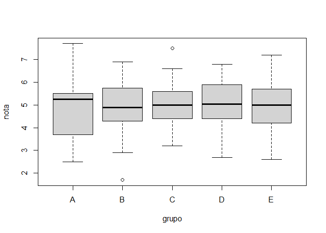
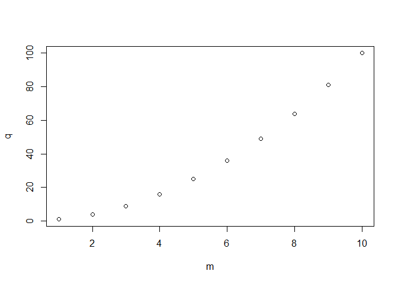
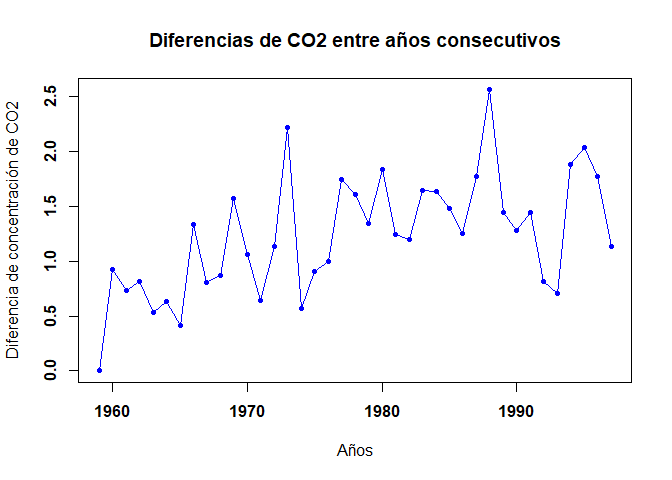
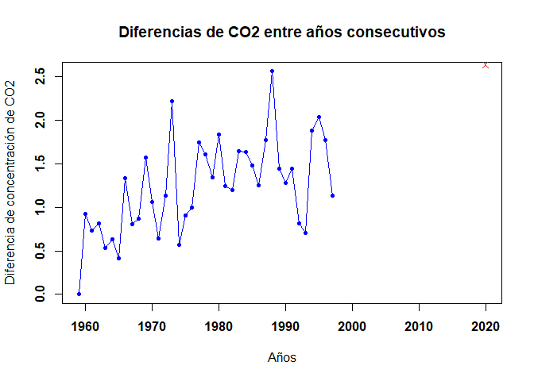

EJERCICIOS
================
De La Cruz, Luque & Quiroz
18/11/2021

## Parte 01

### 1a

``` r
(0.3*0.15)/(0.3*0.15+0.2*0.8+0.5*0.12)
```

    ## [1] 0.1698113

### 1b

``` r
(5^6)/factorial(6)*exp(-5)
```

    ## [1] 0.1462228

### 1c

``` r
(factorial(20)/(factorial(7)*factorial(13)))*0.4^7*0.6^13
```

    ## [1] 0.1658823

### 2a

``` r
sum(1:1000)
```

    ## [1] 500500

### 2b

``` r
((2^11)-1)/2-1
```

    ## [1] 1022.5

### Cargamos los codigos

``` r
load(url("https://goo.gl/uDzU8v"))
```

### 3a

``` r
length(grupo)
```

    ## [1] 192

### 3b

``` r
which(grupo=="A")
```

    ##  [1]   2   8  17  21  28  84 101 108 111 115 123 136 190 192

### 4a

``` r
sum(nota)
```

    ## [1] 962

### 4b

``` r
mean(nota)
```

    ## [1] 5.010417

### 4c

``` r
 which(7.0 < nota)
```

    ## [1]  81 103 120 151

### 4d

``` r
sort(nota, decreasing = TRUE)
```

    ##   [1] 7.7 7.5 7.4 7.2 7.0 6.9 6.9 6.8 6.8 6.8 6.8 6.8 6.6 6.5 6.4 6.4 6.4 6.4
    ##  [19] 6.3 6.2 6.2 6.2 6.2 6.2 6.2 6.1 6.1 6.1 6.1 6.0 6.0 6.0 6.0 6.0 6.0 5.9
    ##  [37] 5.9 5.9 5.9 5.9 5.9 5.9 5.9 5.9 5.8 5.8 5.8 5.8 5.8 5.7 5.7 5.7 5.7 5.7
    ##  [55] 5.6 5.6 5.6 5.6 5.6 5.6 5.5 5.5 5.5 5.5 5.5 5.5 5.5 5.5 5.5 5.5 5.5 5.5
    ##  [73] 5.5 5.4 5.4 5.4 5.4 5.4 5.4 5.4 5.4 5.3 5.3 5.3 5.3 5.2 5.2 5.2 5.2 5.2
    ##  [91] 5.2 5.2 5.1 5.0 5.0 5.0 5.0 5.0 5.0 5.0 5.0 5.0 4.9 4.9 4.9 4.9 4.9 4.9
    ## [109] 4.8 4.8 4.8 4.8 4.8 4.8 4.7 4.7 4.7 4.7 4.7 4.7 4.7 4.7 4.7 4.7 4.6 4.6
    ## [127] 4.6 4.6 4.5 4.5 4.5 4.5 4.5 4.5 4.4 4.4 4.4 4.4 4.4 4.4 4.4 4.3 4.3 4.3
    ## [145] 4.2 4.2 4.2 4.2 4.2 4.2 4.2 4.2 4.1 4.1 4.1 4.1 4.1 4.0 4.0 4.0 4.0 4.0
    ## [163] 4.0 3.9 3.9 3.8 3.8 3.8 3.7 3.7 3.7 3.7 3.6 3.6 3.6 3.5 3.4 3.4 3.4 3.4
    ## [181] 3.2 3.2 3.2 3.1 3.0 2.9 2.9 2.9 2.7 2.6 2.5 1.7

### 4e

``` r
which(nota == max(nota))
```

    ## [1] 120

### 5a

``` r
team21 <- data.frame(grupo, nota)
      team21
```

    ##     grupo nota
    ## 1       B  4.9
    ## 2       A  5.4
    ## 3       E  5.2
    ## 4       D  6.8
    ## 5       B  5.0
    ## 6       D  6.2
    ## 7       D  4.4
    ## 8       A  4.1
    ## 9       D  4.3
    ## 10      C  5.5
    ## 11      D  5.5
    ## 12      E  4.8
    ## 13      B  6.4
    ## 14      E  6.8
    ## 15      E  5.5
    ## 16      E  4.7
    ## 17      A  5.2
    ## 18      B  6.4
    ## 19      C  4.8
    ## 20      C  3.4
    ## 21      A  4.7
    ## 22      C  6.0
    ## 23      C  5.9
    ## 24      D  5.4
    ## 25      D  5.3
    ## 26      E  5.6
    ## 27      E  6.9
    ## 28      A  5.6
    ## 29      B  4.2
    ## 30      C  4.4
    ## 31      C  5.8
    ## 32      E  4.8
    ## 33      D  6.1
    ## 34      C  6.2
    ## 35      E  6.6
    ## 36      E  5.2
    ## 37      E  4.6
    ## 38      E  5.0
    ## 39      D  2.5
    ## 40      D  4.0
    ## 41      D  5.6
    ## 42      E  4.9
    ## 43      E  5.4
    ## 44      E  3.9
    ## 45      D  4.2
    ## 46      E  4.7
    ## 47      B  4.2
    ## 48      E  5.4
    ## 49      D  3.7
    ## 50      C  6.2
    ## 51      E  5.9
    ## 52      D  3.7
    ## 53      E  5.8
    ## 54      E  2.7
    ## 55      C  5.6
    ## 56      B  5.0
    ## 57      D  2.6
    ## 58      C  5.0
    ## 59      E  4.9
    ## 60      D  3.4
    ## 61      E  5.9
    ## 62      B  4.3
    ## 63      D  6.1
    ## 64      B  4.5
    ## 65      B  5.5
    ## 66      C  3.2
    ## 67      D  3.2
    ## 68      C  6.4
    ## 69      C  4.4
    ## 70      C  6.0
    ## 71      E  5.0
    ## 72      D  5.4
    ## 73      E  7.0
    ## 74      D  3.8
    ## 75      C  4.2
    ## 76      D  4.7
    ## 77      E  4.7
    ## 78      E  5.3
    ## 79      C  6.8
    ## 80      D  4.0
    ## 81      C  7.2
    ## 82      E  4.8
    ## 83      D  6.0
    ## 84      A  4.1
    ## 85      B  4.5
    ## 86      B  5.8
    ## 87      E  2.9
    ## 88      E  5.0
    ## 89      C  4.6
    ## 90      D  4.9
    ## 91      C  6.8
    ## 92      E  4.2
    ## 93      E  6.9
    ## 94      C  5.7
    ## 95      E  5.7
    ## 96      D  6.4
    ## 97      D  4.4
    ## 98      D  4.2
    ## 99      E  4.5
    ## 100     D  5.8
    ## 101     A  4.3
    ## 102     D  3.7
    ## 103     B  7.4
    ## 104     B  3.9
    ## 105     C  5.2
    ## 106     D  4.9
    ## 107     E  3.6
    ## 108     A  5.5
    ## 109     E  6.0
    ## 110     E  5.0
    ## 111     A  4.1
    ## 112     C  4.5
    ## 113     E  3.1
    ## 114     D  5.4
    ## 115     A  4.5
    ## 116     D  5.3
    ## 117     D  4.7
    ## 118     C  6.1
    ## 119     E  5.2
    ## 120     E  7.7
    ## 121     E  5.3
    ## 122     D  5.0
    ## 123     A  4.0
    ## 124     E  5.2
    ## 125     E  4.0
    ## 126     E  5.5
    ## 127     C  4.0
    ## 128     C  5.4
    ## 129     B  4.6
    ## 130     C  3.4
    ## 131     C  6.2
    ## 132     D  5.7
    ## 133     C  3.8
    ## 134     B  4.8
    ## 135     C  4.0
    ## 136     A  4.4
    ## 137     D  5.5
    ## 138     E  5.9
    ## 139     D  5.9
    ## 140     E  5.7
    ## 141     E  4.9
    ## 142     B  1.7
    ## 143     E  5.5
    ## 144     E  5.9
    ## 145     E  5.5
    ## 146     E  3.8
    ## 147     C  5.5
    ## 148     B  6.0
    ## 149     D  3.5
    ## 150     D  5.5
    ## 151     E  7.5
    ## 152     E  3.4
    ## 153     D  5.8
    ## 154     D  4.7
    ## 155     E  3.6
    ## 156     D  4.1
    ## 157     E  5.0
    ## 158     D  4.6
    ## 159     D  3.6
    ## 160     C  4.7
    ## 161     D  4.1
    ## 162     D  5.7
    ## 163     D  5.9
    ## 164     C  4.7
    ## 165     E  3.2
    ## 166     D  5.5
    ## 167     E  3.0
    ## 168     C  4.5
    ## 169     E  5.5
    ## 170     B  5.9
    ## 171     C  5.6
    ## 172     C  6.0
    ## 173     C  4.4
    ## 174     D  3.7
    ## 175     D  4.4
    ## 176     B  6.8
    ## 177     D  6.1
    ## 178     B  4.7
    ## 179     E  4.2
    ## 180     C  6.2
    ## 181     E  5.2
    ## 182     D  5.1
    ## 183     D  2.9
    ## 184     E  6.5
    ## 185     D  4.2
    ## 186     B  5.4
    ## 187     B  5.9
    ## 188     E  6.2
    ## 189     E  6.3
    ## 190     A  4.8
    ## 191     C  5.6
    ## 192     A  2.9

``` r
      head(team21,10)
```

    ##    grupo nota
    ## 1      B  4.9
    ## 2      A  5.4
    ## 3      E  5.2
    ## 4      D  6.8
    ## 5      B  5.0
    ## 6      D  6.2
    ## 7      D  4.4
    ## 8      A  4.1
    ## 9      D  4.3
    ## 10     C  5.5

``` r
      sum(head(team21$nota,10))
```

    ## [1] 51.8

### 5b

``` r
length(grupo[grupo=="C"]) 
```

    ## [1] 39

### 5c

``` r
length(nota[nota>5])
```

    ## [1] 93

### 5d

``` r
which(team21$grupo == "B"& team21$nota>5)
```

    ##  [1]  13  18  65  86 103 148 170 176 186 187

``` r
      length(which(grupo == "B" & nota>5))
```

    ## [1] 10

### 5e

``` r
(100*22)/39
```

    ## [1] 56.41026

``` r
      length(which(team21$grupo == "C" & team21$nota>5))/length(which(team21$grupo=="C"))*100
```

    ## [1] 56.41026

### 5f

``` r
which.max(nota)
```

    ## [1] 120

``` r
      which.min(nota)
```

    ## [1] 142

``` r
      nota[120]
```

    ## [1] 7.7

``` r
      nota[142]
```

    ## [1] 1.7

``` r
      grupo[120]
```

    ## [1] "E"

``` r
      grupo[142]
```

    ## [1] "B"

### 5g

``` r
 which(team21$grupo == "A" & team21$nota>5) 
```

    ## [1]   2  17  28 108

``` r
      which(team21$grupo == "B"& team21$nota>5)
```

    ##  [1]  13  18  65  86 103 148 170 176 186 187

``` r
      notas_A <- nota[ c(2,  17,  28, 108)]
      notas_B <- nota [c(13,  18,  65,  86, 103, 148, 170, 176, 186, 187)]
      mean(notas_A<-nota[ c(2,  17,  28, 108)])
```

    ## [1] 5.425

``` r
      mean (nota[c(13,  18,  65,  86, 103, 148, 170, 176, 186, 187)])
```

    ## [1] 6.15

``` r
      notas_C<-nota[c(2,  17,  28, 108, 13,  18,  65,  86, 103, 148, 170, 176, 186, 187)]
      mean(notas_C)
```

    ## [1] 5.942857

### 6

``` r
66*length(nota)/100
```

    ## [1] 126.72

``` r
    nota_ordenada <- sort(nota)
    nota_ordenada -> nota
    nota_ordenada[126]      
```

    ## [1] 5.5

``` r
    nota_ordenada[127] 
```

    ## [1] 5.5

### 7

``` r
length(which(nota<=4.9))/length(nota)*100
```

    ## [1] 46.875

``` r
    length(which(nota>=4.9))/length(nota)*100
```

    ## [1] 56.25

``` r
    which(nota==4.9)
```

    ## [1] 85 86 87 88 89 90

### 8

``` r
boxplot(nota ~ grupo)
```

<!-- -->
### 9a

``` r
max(conc)
```

    ## [1] 47.34

### 9b

``` r
length(which(conc> 40.0))
```

    ## [1] 61

### 9c

``` r
mean(conc)
```

    ## [1] 24.07229

### 9d

``` r
head(sort(conc),10)
```

    ##  [1] 0.93 1.07 1.77 2.03 2.58 2.73 2.75 2.88 2.88 2.91

### 9e

``` r
max(conc)
```

    ## [1] 47.34

``` r
      conc[47.34]
```

    ## [1] 12.91

``` r
      which(conc==max(conc))
```

    ## [1] 142

``` r
      288/(24*60)
```

    ## [1] 0.2

``` r
      (83-8)/90*60
```

    ## [1] 50

## Parte 02

### 1

``` r
m <- 1:10
      q <- m^2
      plot(m,q)
```

<!-- -->
### 2

``` r
matrix(c(1,2,3,2,4,6, 3,6,9,4,8,12),nrow = 4,ncol = 3,byrow = TRUE)
```

    ##      [,1] [,2] [,3]
    ## [1,]    1    2    3
    ## [2,]    2    4    6
    ## [3,]    3    6    9
    ## [4,]    4    8   12

### 3

``` r
diag(3)
```

    ##      [,1] [,2] [,3]
    ## [1,]    1    0    0
    ## [2,]    0    1    0
    ## [3,]    0    0    1

### 4

``` r
F4 <- function(n) { I <- diag(n); for(i in 1:n){I[i,i]=0}; return(I)}
      F4(4)
```

    ##      [,1] [,2] [,3] [,4]
    ## [1,]    0    0    0    0
    ## [2,]    0    0    0    0
    ## [3,]    0    0    0    0
    ## [4,]    0    0    0    0

### 5

``` r
D <-diag(4)
      D[1,1] = 0
      D[2,2] = 2
      D[3,3] = 3
      D[4,4] = 4
      D
```

    ##      [,1] [,2] [,3] [,4]
    ## [1,]    0    0    0    0
    ## [2,]    0    2    0    0
    ## [3,]    0    0    3    0
    ## [4,]    0    0    0    4

### 6

``` r
t(matrix(c(1,2,3,2,4,6, 3,6,9,4,8,12),nrow = 4,ncol = 3,byrow = TRUE))
```

    ##      [,1] [,2] [,3] [,4]
    ## [1,]    1    2    3    4
    ## [2,]    2    4    6    8
    ## [3,]    3    6    9   12

### 7

``` r
A7 <- matrix(c(1,2,3,4,2,4,6,8,3,6,9,12,0,0,0,0), nrow = 4 , ncol = 4)
      B7 <- matrix(c(0,0,0,0,2,0,0,0,0,3,0,0,0,0,0,4), ncol=4)
      (A7+B7)
```

    ##      [,1] [,2] [,3] [,4]
    ## [1,]    1    4    3    0
    ## [2,]    2    4    9    0
    ## [3,]    3    6    9    0
    ## [4,]    4    8   12    4

``` r
      (A7-B7)
```

    ##      [,1] [,2] [,3] [,4]
    ## [1,]    1    0    3    0
    ## [2,]    2    4    3    0
    ## [3,]    3    6    9    0
    ## [4,]    4    8   12   -4

``` r
      (A7*B7)
```

    ##      [,1] [,2] [,3] [,4]
    ## [1,]    0    4    0    0
    ## [2,]    0    0   18    0
    ## [3,]    0    0    0    0
    ## [4,]    0    0    0    0

``` r
      (3*B7)
```

    ##      [,1] [,2] [,3] [,4]
    ## [1,]    0    6    0    0
    ## [2,]    0    0    9    0
    ## [3,]    0    0    0    0
    ## [4,]    0    0    0   12

### 8

``` r
 F8<-function(M,n){S=M;for(i in 2:n){S=S%*%M};print(S)}
      P <- matrix(c(1,-2,1,2,4,0,3,-2,1), ncol=3, nrow=3)
      F8(P,6)
```

    ##       [,1]  [,2]  [,3]
    ## [1,] -1792    24 -2824
    ## [2,]  -464 -2416 -1344
    ## [3,]  -648   440  -912

### 9

``` r
A9 = matrix(c(3,9,3,-1,-2,1,1,1,-2), ncol=3,nrow=3)
      x9 <- c(-1,-9,-9)
      solve(A9,x9)
```

    ## [1] -1  2  4

### 10

help(eigen) help(det) ### 11

``` r
M1 <- c(1:10)
      M2 <- seq(2, 20, by = 2)
      M3 <- seq(3, 30, by = 3)
      M4 <- seq(4, 40, by = 4)
      M5 <- seq(5, 50, by = 5)
      B11 = cbind(M1, M2, M3, M4, M5)
      B11
```

    ##       M1 M2 M3 M4 M5
    ##  [1,]  1  2  3  4  5
    ##  [2,]  2  4  6  8 10
    ##  [3,]  3  6  9 12 15
    ##  [4,]  4  8 12 16 20
    ##  [5,]  5 10 15 20 25
    ##  [6,]  6 12 18 24 30
    ##  [7,]  7 14 21 28 35
    ##  [8,]  8 16 24 32 40
    ##  [9,]  9 18 27 36 45
    ## [10,] 10 20 30 40 50

``` r
      N1 <- c(0,1,0,0,1)
      N2 <- c(1,0,1,1,0)
      N3 <- c(0,1,0,0,1)
      N4 <- c(1,0,1,0,1)
      N5 <- c(0,1,0,1,0)
      A11 = cbind(N1,N2,N3,N4,N5)
      A11
```

    ##      N1 N2 N3 N4 N5
    ## [1,]  0  1  0  1  0
    ## [2,]  1  0  1  0  1
    ## [3,]  0  1  0  1  0
    ## [4,]  0  1  0  0  1
    ## [5,]  1  0  1  1  0

``` r
      B11%*%A11-B11%*%t(A11)
```

    ##       N1  N2 N3 N4  N5
    ##  [1,]  1  -1  1  2  -2
    ##  [2,]  2  -2  2  4  -4
    ##  [3,]  3  -3  3  6  -6
    ##  [4,]  4  -4  4  8  -8
    ##  [5,]  5  -5  5 10 -10
    ##  [6,]  6  -6  6 12 -12
    ##  [7,]  7  -7  7 14 -14
    ##  [8,]  8  -8  8 16 -16
    ##  [9,]  9  -9  9 18 -18
    ## [10,] 10 -10 10 20 -20

### 12

``` r
x12 <- matrix(c(1,1,1,1,1,1,-1,0,1,2), nrow = 5, ncol = 2)
      y12 <- matrix(c(0,0,1,1,3), nrow = , ncol = 1)
      ((t(x12)%*%x12)^-1)%*%(t(x12)%*%y12)
```

    ##          [,1]
    ## [1,] 3.333333
    ## [2,] 2.666667

### 13a

``` r
x12 <- matrix(c(1,1,1,1,1,1,-1,0,1,2), nrow = 5, ncol = 2)
      y12 <- matrix(c(0,0,1,1,3), nrow = , ncol = 1)
      ((t(x12)%*%x12)^-1)%*%(t(x12)%*%y12)
```

    ##          [,1]
    ## [1,] 3.333333
    ## [2,] 2.666667

### 13b

``` r
load(url("https://goo.gl/uDzU8v"))

data(co2)

means = aggregate(co2, FUN=mean)

year = as.vector(time(means))

co2 = as.vector(means)

y <- c(0, diff(co2))

plot(year,y, type = "o", pch = 20, xlab = "Años", ylab = "Diferencia de concentración de CO2", 

main = "Diferencias de CO2 entre años consecutivos", col = "blue", font = 2)
```

<!-- -->
### 13c

``` r
load(url("https://goo.gl/uDzU8v"))
data(co2)
means = aggregate(co2, FUN=mean)
year = as.vector(time(means))
co2 = as.vector(means)
y <- c(0, diff(co2))
plot(year, y, xlim=c(1959, 2020), type = "o", pch = 20, xlab = "Años", ylab = "Diferencia de concentración de CO2", 
main = "Diferencias de CO2 entre años consecutivos", col = "blue", font = 2)
points(2020, 2.64, pch = 4, col = "red")
```

<!-- -->
