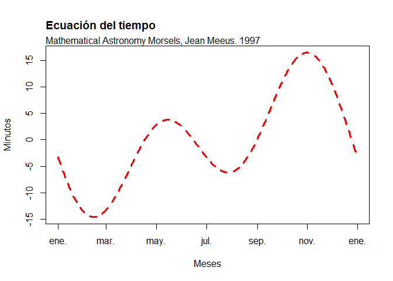

TAREA 02 PROGRAMACION
================
De La Cruz, Luque & Garcia
24/11/2021

## EJERCICIOS

### 1

``` r
10000%%3
```

    ## [1] 1

### 2

``` r
0 == (4560%%3)
```

    ## [1] TRUE

### 3

``` r
numeros_enteros <- c(2:87)
divisibles_7 <- (0 == numeros_enteros%%7)
which(divisibles_7 == TRUE)
```

    ##  [1]  6 13 20 27 34 41 48 55 62 69 76 83

``` r
numeros_enteros[c(6,13,20,27,34,41,48,55,62,69,76,83)]
```

    ##  [1]  7 14 21 28 35 42 49 56 63 70 77 84

### 4

``` r
primer_vector <- c(seq(7,3,-1))
segundo_vector <- c(head(seq(0,100,5),5))
```

#### 4a

``` r
A <- (0 == primer_vector%%2)
which(A == TRUE)
```

    ## [1] 2 4

``` r
primer_vector [c(2,4)]
```

    ## [1] 6 4

#### 4b

``` r
B <- which(segundo_vector >10)
segundo_vector [c(4,5)]
```

    ## [1] 15 20

#### 4c

``` r
for (i in 1:5) {
  for (j in 1:5){
    if(i==j)
    {if(primer_vector[i]==segundo_vector[j]){
      print(i)
    }
      
    }
  }
}
print("no hay datos")
```

    ## [1] "no hay datos"

### 5

``` r
Gauss <- function(a) {
  r1 <- (a*(a+1))/2
  return(r1)
} 
Gauss(a = 100)
```

    ## [1] 5050

### 6

``` r
k <- c(1,-4,5,9,-4)
min(k)
```

    ## [1] -4

``` r
which(k==-4)
```

    ## [1] 2 5

### 7

``` r
factorial(8)
```

    ## [1] 40320

### 8

``` r
sumatoria1 <- function(i){
  exp(i)
}
sumatoria1(3:7)
```

    ## [1]   20.08554   54.59815  148.41316  403.42879 1096.63316

``` r
sum(sumatoria1(3:7))
```

    ## [1] 1723.159

### 9

``` r
mifuncion <- function(i){
  log10(sqrt(i))
}
a <- mifuncion(1:10)
prod(a)
```

    ## [1] 0

### 10

``` r
Areacorona <- function(x,y){
  ((x)^2)/2*(y-sin(y))
}
Areacorona(4,pi/4)
```

    ## [1] 0.6263311

### 11

``` r
vector_11 <- c(1:10)
sort(vector_11,decreasing = T)
```

    ##  [1] 10  9  8  7  6  5  4  3  2  1

``` r
rev(vector_11)
```

    ##  [1] 10  9  8  7  6  5  4  3  2  1

### 12

``` r
g <- 10:100
h <- g^3
i <- g^2
sum(h) + sum(4*i)
```

    ## [1] 26852735

### 13

``` r
a <- 1:25
b <- (2^a)/a
c <- (3^a)/a^2
sum(b) + sum(c)
```

    ## [1] 2129170437

### 14

``` r
dataset <- read.delim("https://raw.githubusercontent.com/fhernanb/datos/master/Paises.txt")
length(dataset)
```

    ## [1] 5

#### 14a

``` r
dataset$Pais
```

    ##   [1] "Acerbaján_"       "Afganistán"       "Alemania"        
    ##   [4] "Arabia_Saudí"     "Argentina_"       "Armenia_"        
    ##   [7] "Australia_"       "Austria_"         "Bahrein_"        
    ##  [10] "Bangladesh"       "Barbados"         "Bélgica_"        
    ##  [13] "Bielorusia"       "Bolivia_"         "Bosnia"          
    ##  [16] "Botswana"         "Brasil"           "Bulgaria"        
    ##  [19] "Burkina_Faso"     "Burundi_"         "Camboya_"        
    ##  [22] "Camerún_"         "Canadá"           "Chile_"          
    ##  [25] "China_"           "Colombia"         "Corea_del_Norte_"
    ##  [28] "Corea_del_Sur_"   "Costa_Rica"       "Croacia_"        
    ##  [31] "Cuba"             "Dinamarca_"       "Ecuador_"        
    ##  [34] "Egipto"           "El_Salvador_"     "Emiratos_Árabes_"
    ##  [37] "España"           "Estados_Unidos"   "Estonia_"        
    ##  [40] "Etiopía_"         "Filipinas_"       "Finlandia_"      
    ##  [43] "Francia_"         "Gabón_"           "Gambia"          
    ##  [46] "Georgia_"         "Gran_Bretaña"     "Grecia"          
    ##  [49] "Guatemala_"       "Haití_"           "Honduras"        
    ##  [52] "Hong_Kong_"       "Hungía"           "India_"          
    ##  [55] "Indonesia_"       "Irán"             "Iraq"            
    ##  [58] "Irlanda_"         "Islandia"         "Israel"          
    ##  [61] "Italia"           "Japón_"           "Jordania"        
    ##  [64] "Kenia_"           "Kuwait"           "Letonia_"        
    ##  [67] "Líbano"           "Liberia_"         "Libia_"          
    ##  [70] "Lituania"         "Malasia_"         "Marruecos_"      
    ##  [73] "México"           "Nicaragua_"       "Nigeria_"        
    ##  [76] "Noruega_"         "Nueva_Zelanda_"   "Países_Bajos"    
    ##  [79] "Pakistán"         "Panamá"           "Paraguay"        
    ##  [82] "Perú"             "Polonia_"         "Portugal"        
    ##  [85] "Rep._C._Africana" "Rep._Dominicana_" "Ruanda"          
    ##  [88] "Rumanía_"         "Rusia_"           "Senegal_"        
    ##  [91] "Singapur"         "Siria_"           "Somalia_"        
    ##  [94] "Sudáfrica_"       "Suecia"           "Suiza_"          
    ##  [97] "Tailandia_"       "Taiwan"           "Tanzania"        
    ## [100] "Turquía_"         "Ucrania_"         "Uganda"          
    ## [103] "Uruguay_"         "Uzbekistán"       "Venezuela_"      
    ## [106] "Vietnam_"         "Zambia"

``` r
length(dataset$Pais)
```

    ## [1] 107

#### 14b

``` r
dataset$Pais
```

    ##   [1] "Acerbaján_"       "Afganistán"       "Alemania"        
    ##   [4] "Arabia_Saudí"     "Argentina_"       "Armenia_"        
    ##   [7] "Australia_"       "Austria_"         "Bahrein_"        
    ##  [10] "Bangladesh"       "Barbados"         "Bélgica_"        
    ##  [13] "Bielorusia"       "Bolivia_"         "Bosnia"          
    ##  [16] "Botswana"         "Brasil"           "Bulgaria"        
    ##  [19] "Burkina_Faso"     "Burundi_"         "Camboya_"        
    ##  [22] "Camerún_"         "Canadá"           "Chile_"          
    ##  [25] "China_"           "Colombia"         "Corea_del_Norte_"
    ##  [28] "Corea_del_Sur_"   "Costa_Rica"       "Croacia_"        
    ##  [31] "Cuba"             "Dinamarca_"       "Ecuador_"        
    ##  [34] "Egipto"           "El_Salvador_"     "Emiratos_Árabes_"
    ##  [37] "España"           "Estados_Unidos"   "Estonia_"        
    ##  [40] "Etiopía_"         "Filipinas_"       "Finlandia_"      
    ##  [43] "Francia_"         "Gabón_"           "Gambia"          
    ##  [46] "Georgia_"         "Gran_Bretaña"     "Grecia"          
    ##  [49] "Guatemala_"       "Haití_"           "Honduras"        
    ##  [52] "Hong_Kong_"       "Hungía"           "India_"          
    ##  [55] "Indonesia_"       "Irán"             "Iraq"            
    ##  [58] "Irlanda_"         "Islandia"         "Israel"          
    ##  [61] "Italia"           "Japón_"           "Jordania"        
    ##  [64] "Kenia_"           "Kuwait"           "Letonia_"        
    ##  [67] "Líbano"           "Liberia_"         "Libia_"          
    ##  [70] "Lituania"         "Malasia_"         "Marruecos_"      
    ##  [73] "México"           "Nicaragua_"       "Nigeria_"        
    ##  [76] "Noruega_"         "Nueva_Zelanda_"   "Países_Bajos"    
    ##  [79] "Pakistán"         "Panamá"           "Paraguay"        
    ##  [82] "Perú"             "Polonia_"         "Portugal"        
    ##  [85] "Rep._C._Africana" "Rep._Dominicana_" "Ruanda"          
    ##  [88] "Rumanía_"         "Rusia_"           "Senegal_"        
    ##  [91] "Singapur"         "Siria_"           "Somalia_"        
    ##  [94] "Sudáfrica_"       "Suecia"           "Suiza_"          
    ##  [97] "Tailandia_"       "Taiwan"           "Tanzania"        
    ## [100] "Turquía_"         "Ucrania_"         "Uganda"          
    ## [103] "Uruguay_"         "Uzbekistán"       "Venezuela_"      
    ## [106] "Vietnam_"         "Zambia"

``` r
length(dataset$Pais)
```

    ## [1] 107

#### 14c

``` r
dataset$Pais[which.max(dataset$poblacion)]
```

    ## [1] "China_"

#### 14d

``` r
dataset$Pais [which.min(dataset$alfabetizacion)]
```

    ## [1] "Burkina_Faso"

### 15

#### help(“mtcars”)

#### 15a

``` r
row.names(mtcars)[which(mtcars$mpg <18)]
```

    ##  [1] "Duster 360"          "Merc 280C"           "Merc 450SE"         
    ##  [4] "Merc 450SL"          "Merc 450SLC"         "Cadillac Fleetwood" 
    ##  [7] "Lincoln Continental" "Chrysler Imperial"   "Dodge Challenger"   
    ## [10] "AMC Javelin"         "Camaro Z28"          "Ford Pantera L"     
    ## [13] "Maserati Bora"

#### 15b

``` r
row.names(mtcars)[which(mtcars$cyl == 4)]
```

    ##  [1] "Datsun 710"     "Merc 240D"      "Merc 230"       "Fiat 128"      
    ##  [5] "Honda Civic"    "Toyota Corolla" "Toyota Corona"  "Fiat X1-9"     
    ##  [9] "Porsche 914-2"  "Lotus Europa"   "Volvo 142E"

#### 15c

``` r
row.names(mtcars)[which(mtcars$wt >2,5 & mtcars$am =="1")]
```

    ##  [1] "Mazda RX4"           "Mazda RX4 Wag"       "Datsun 710"         
    ##  [4] "Hornet 4 Drive"      "Hornet Sportabout"   "Valiant"            
    ##  [7] "Duster 360"          "Merc 240D"           "Merc 230"           
    ## [10] "Merc 280"            "Merc 280C"           "Merc 450SE"         
    ## [13] "Merc 450SL"          "Merc 450SLC"         "Cadillac Fleetwood" 
    ## [16] "Lincoln Continental" "Chrysler Imperial"   "Fiat 128"           
    ## [19] "Toyota Corona"       "Dodge Challenger"    "AMC Javelin"        
    ## [22] "Camaro Z28"          "Pontiac Firebird"    "Porsche 914-2"      
    ## [25] "Ford Pantera L"      "Ferrari Dino"        "Maserati Bora"      
    ## [28] "Volvo 142E"

### 16

``` r
x <- 0:365
y <- 2*3.14*(x-81)/365

Funcion01 <- function(y) {
  x <- 9.87 *2 *sin(y)*cos(y)-7.53 * cos(y) -1.5* sin(y)
  return(x)
}
Funcion01(y)
```

    ##   [1]  -3.27475168  -3.72329563  -4.16741572  -4.60670342  -5.04075588
    ##   [6]  -5.46917639  -5.89157481  -6.30756799  -6.71678019  -7.11884351
    ##  [11]  -7.51339828  -7.90009342  -8.27858687  -8.64854594  -9.00964767
    ##  [16]  -9.36157917  -9.70403796 -10.03673232 -10.35938155 -10.67171633
    ##  [21] -10.97347896 -11.26442364 -11.54431674 -11.81293705 -12.07007598
    ##  [26] -12.31553781 -12.54913985 -12.77071267 -12.98010023 -13.17716005
    ##  [31] -13.36176336 -13.53379517 -13.69315447 -13.83975421 -13.97352145
    ##  [36] -14.09439739 -14.20233740 -14.29731109 -14.37930223 -14.44830883
    ##  [41] -14.50434307 -14.54743127 -14.57761381 -14.59494508 -14.59949340
    ##  [46] -14.59134086 -14.57058326 -14.53732992 -14.49170356 -14.43384011
    ##  [51] -14.36388854 -14.28201065 -14.18838084 -14.08318593 -13.96662485
    ##  [56] -13.83890843 -13.70025913 -13.55091072 -13.39110801 -13.22110652
    ##  [61] -13.04117221 -12.85158105 -12.65261879 -12.44458050 -12.22777027
    ##  [66] -12.00250081 -11.76909305 -11.52787578 -11.27918521 -11.02336457
    ##  [71] -10.76076369 -10.49173857 -10.21665095  -9.93586787  -9.64976122
    ##  [76]  -9.35870726  -9.06308622  -8.76328180  -8.45968072  -8.15267223
    ##  [81]  -7.84264767  -7.53000000  -7.21512329  -6.89841227  -6.58026188
    ##  [86]  -6.26106675  -5.94122077  -5.62111657  -5.30114511  -4.98169516
    ##  [91]  -4.66315287  -4.34590131  -4.03031999  -3.71678443  -3.40566571
    ##  [96]  -3.09733004  -2.79213830  -2.49044564  -2.19260105  -1.89894696
    ## [101]  -1.60981882  -1.32554472  -1.04644501  -0.77283189  -0.50500911
    ## [106]  -0.24327155   0.01209508   0.26081458   0.50262061   0.73725692
    ## [111]   0.96447776   1.18404803   1.39574368   1.59935184   1.79467116
    ## [116]   1.98151199   2.15969658   2.32905932   2.48944690   2.64071845
    ## [121]   2.78274574   2.91541330   3.03861853   3.15227182   3.25629660
    ## [126]   3.35062950   3.43522031   3.51003207   3.57504111   3.63023702
    ## [131]   3.67562266   3.71121415   3.73704081   3.75314511   3.75958259
    ## [136]   3.75642181   3.74374419   3.72164393   3.69022786   3.64961529
    ## [141]   3.59993787   3.54133936   3.47397547   3.39801364   3.31363284
    ## [146]   3.22102326   3.12038616   3.01193353   2.89588782   2.77248168
    ## [151]   2.64195763   2.50456777   2.36057341   2.21024477   2.05386062
    ## [156]   1.89170792   1.72408143   1.55128337   1.37362299   1.19141621
    ## [161]   1.00498519   0.81465793   0.62076782   0.42365327   0.22365723
    ## [166]   0.02112677  -0.18358738  -0.39013126  -0.59814811  -0.80727890
    ## [171]  -1.01716271  -1.22743722  -1.43773921  -1.64770495  -1.85697072
    ## [176]  -2.06517326  -2.27195023  -2.47694068  -2.67978550  -2.88012789
    ## [181]  -3.07761382  -3.27189247  -3.46261670  -3.64944347  -3.83203430
    ## [186]  -4.01005571  -4.18317962  -4.35108381  -4.51345231  -4.66997582
    ## [191]  -4.82035212  -4.96428643  -5.10149182  -5.23168960  -5.35460964
    ## [196]  -5.46999076  -5.57758105  -5.67713823  -5.76842993  -5.85123405
    ## [201]  -5.92533901  -5.99054406  -6.04665956  -6.09350719  -6.13092027
    ## [206]  -6.15874391  -6.17683528  -6.18506380  -6.18331132  -6.17147227
    ## [211]  -6.14945388  -6.11717627  -6.07457256  -6.02158905  -5.95818525
    ## [216]  -5.88433398  -5.80002145  -5.70524728  -5.60002454  -5.48437977
    ## [221]  -5.35835296  -5.22199756  -5.07538041  -4.91858173  -4.75169501
    ## [226]  -4.57482696  -4.38809738  -4.19163909  -3.98559774  -3.77013171
    ## [231]  -3.54541194  -3.31162172  -3.06895654  -2.81762386  -2.55784290
    ## [236]  -2.28984438  -2.01387030  -1.73017365  -1.43901816  -1.14067797
    ## [241]  -0.83543736  -0.52359044  -0.20544077   0.11869891   0.44850710
    ## [246]   0.78365383   1.12380111   1.46860326   1.81770730   2.17075340
    ## [251]   2.52737523   2.88720042   3.24985098   3.61494371   3.98209066
    ## [256]   4.35089960   4.72097440   5.09191556   5.46332065   5.83478474
    ## [261]   6.20590091   6.57626073   6.94545469   7.31307270   7.67870459
    ## [266]   8.04194055   8.40237162   8.75959019   9.11319044   9.46276885
    ## [271]   9.80792466  10.14826032  10.48338199  10.81290000  11.13642927
    ## [276]  11.45358983  11.76400720  12.06731289  12.36314480  12.65114765
    ## [281]  12.93097344  13.20228183  13.46474055  13.71802578  13.96182260
    ## [286]  14.19582530  14.41973776  14.63327385  14.83615772  15.02812416
    ## [291]  15.20891892  15.37829903  15.53603306  15.68190144  15.81569672
    ## [296]  15.93722381  16.04630024  16.14275639  16.22643568  16.29719479
    ## [301]  16.35490384  16.39944653  16.43072033  16.44863662  16.45312075
    ## [306]  16.44411221  16.42156470  16.38544617  16.33573892  16.27243960
    ## [311]  16.19555928  16.10512339  16.00117178  15.88375864  15.75295247
    ## [316]  15.60883604  15.45150630  15.28107426  15.09766494  14.90141719
    ## [321]  14.69248357  14.47103019  14.23723656  13.99129536  13.73341227
    ## [326]  13.46380574  13.18270675  12.89035857  12.58701651  12.27294763
    ## [331]  11.94843045  11.61375464  11.26922074  10.91513981  10.55183306
    ## [336]  10.17963156   9.79887584   9.40991550   9.01310889   8.60882263
    ## [341]   8.19743128   7.77931689   7.35486858   6.92448214   6.48855954
    ## [346]   6.04750855   5.60174221   5.15167848   4.69773966   4.24035202
    ## [351]   3.77994526   3.31695208   2.85180767   2.38494926   1.91681560
    ## [356]   1.44784650   0.97848232   0.50916352   0.04033014  -0.42757869
    ## [361]  -0.89412520  -1.35887349  -1.82139004  -2.28124410  -2.73800828
    ## [366]  -3.19125893

``` r
x <-seq(as.Date("2021-01-01"), as.Date("2022-01-01"), "day")

plot(x, Funcion01(y), ylab = "Minutos", xlab = "Meses", col ="red", type = "l", lwd = 3, lty = 2)
mtext("Mathematical Astronomy Morsels, Jean Meeus. 1997", side = 3, adj = 0)
title("Ecuación del tiempo",
      adj = 0.000001,
      line = 1.5)
```

<!-- -->
